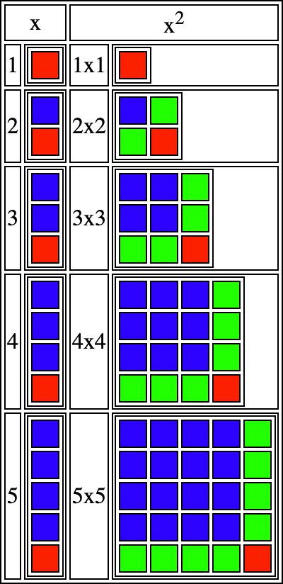
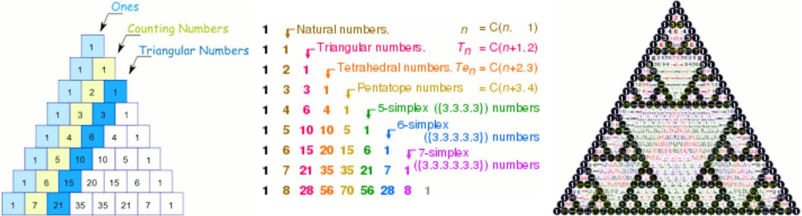
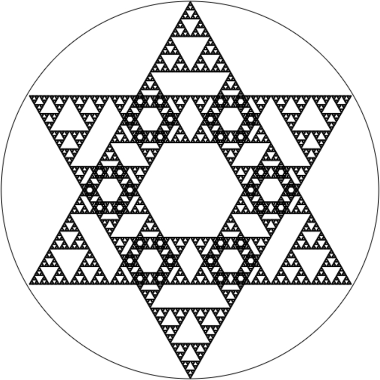
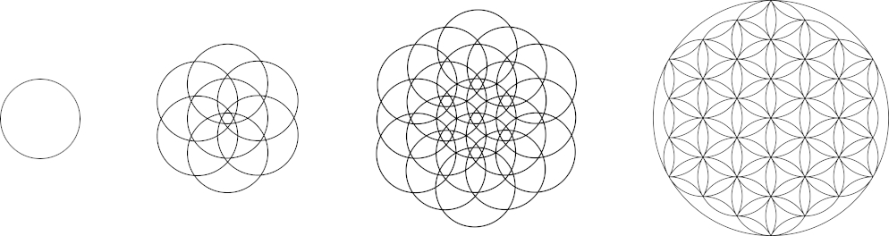

<body onload="setup();">

<h1>Indexed contents</h1>

<table>
  <tr><td>Introduction: <a href="#intro">Link</a></td></tr>
  <tr><td>The basic algorithm: <a href="#basic">Link</a></td></tr>
  <tr><td>The geometry of higher dimensions: <a href="#dims">Link</a></td></tr>
  <tr><td>Fast dimensional subtraction: <a href="#sub-dims">Link</a></td></tr>
  <tr><td>Decoding dimensional iteration: <a href="#decoding">Link</a></td></tr>
  <tr><td>The matrix structure: <a href="#geometry">Link</a></td></tr>
  <tr><td>Golden ratio/Quasicrystals: <a href="#ratio">Link</a></td></tr>
  <tr><td>Can AI become self aware: <a href="#consciousness">Link</a></td></tr>
</table>

<h1>Introduction</h1>

No matter how complex of a calculation or steps you write to output a result, the results can all be reduced back to what it takes to reproduce the measurements or results without knowing the steps.

  

Anything we measure can be reduced back into math calculations or functions. Our brain typically does this sort of thing without us even realizing it.

  

Our brain recalls these patterns and sequences from memory, allowing us to build thoughts, ideas, and brain function.

  

Reality itself follows the same principles known as the law of <a href="https://www.opencollege.info/law-of-cause-and-effect/" target="_blank">cause and effect</a>.

  

Everything spans from each other sequentially known as <a href="https://youtu.be/16W7c0mb-rE" target="_blank">emergence</a>.

  

Note that all examples on this page can be modified, so you can change the examples to see the effects.

  

<h1>Solving a Dimensional Set</h1>

 

Let's start with a one-dimensional set, and show how it builds, and solves sequentially. Starting from here will help you see how it works.

  

A one dimensional set basically is counting by one per number, or by two per number.

  

So lets build a one dimensional set that is 7 more per number.

  

<code>
  var data = [];

  var end = 8;

  var start = 1;

  var per1 = 7;

  for (var i1 = 0; i1 < end; i1++)
  {
    data[i1] = start;

    for (var i2 = 0; i2 < i1; i2++)
    {
      data[i1] += per1;
    }
  }

  console.log(data);
</code>

  

This simple little code creates a set with the starting value of 1. Which you can change to anything by changing <h3>var start = 1;</h3> from 1 to any number you wish.

  

The second loop adds per 7 more to each value. Which you can change to anything you like by changing <h3>var per1 = 7;</h3> from 7 to any number you like.

  

You can change the numbers to anything you like and run the code again to create any one dimensional set.

  

Lastly the <h3>var end = 8;</h3> can be changed to a bigger number than 8. If you want to make the set longer.

  

The starting amount is always the first digit in the set. This is before we calculate the difference between the numbers.

  

The starting amount is very important as you could start anywhere. What ever you set the starting value to will be the first number in the set.

  

In the case of the example I gave you. We ended up with the following set starting with 1, and adding by 7 per value.

  

1,8,15,22,29,36,43,50

  

The starting amount is 1. This solves what the starting amount is.

  

Then all you have to do is subtract the next number by the previous number.

  

The next number after 1 is 8 so 8-1=7.

  

You then move to the next number in the set which is 8. The number after 8 is 15. So 15-8=7.

  

You do this with all numbers in the set. This solves the first dimensional loop. As it solves the difference between the numbers per iteration.

  

8-1=7 
15-8=7 
22-15=7 
29-22=7 
36-29=7 
43-36=7 
50-43=7

  

This gives us how much is added per value. The difference is the same across all numbers making a set of 7,7,7,7,7,7,7 per value.

  

Subtracting the set of 7,7,7,7,7,7,7 the same way will give a set of 0,0,0,0,0,0. Which means there is nothing left in the set per value.

  

<h1>Solving a 2-dimensional set</h1>

 

In the previous example it is quite easy to see that subtracting the next number into the previous number finds the first dimension per added value.

  

So I will show you what happens when you add another dimension.

  

<code>
  var data = [];

  var end = 8;

  var start = 0;

  var per1 = 1;

  var per2 = 2;

  for( var i1 = 0; i1 < end; i1++ )
  {
    data[i1] = start;

    for( var i2 = 0; i2 < i1; i2++ )
    {
      data[i1] += per1;

      for( var i3 = 0; i3 < i2; i3++ )
      {
        data[i1] += per2;
      }
    }
  }

  console.log(data);
</code>

  

In this example we create a square using a 2D set. Which is the calculation X2.

  

We will talk about what a square actually is in the geometry section.

  

Our set is 0,1,4,9,16,25,36,49.

So the first number in the set is 0. Which means the starting value is 0. <h3>var start = 0;</h3>

Subtracting the next value into the previous value gives us.

  

1-0=1 
4-1=3 
9-4=5 
16-9=7 
25-16=9 
36-25=11 
49-36=13

  

This gives us the set 1,3,5,7,9,11,13. The first result will be the first dimension which is 1. <h3>var per1 = 1;</h3>

Subtracting the numbers 1,3,5,7,9,11,13. Going next number by previous number again.

  

3-1=2 
5-3=2 
7-5=2 
9-7=2 
11-9=2 
13-11=2

  

This solves the difference in the second dimension. Which is 2 more. <h3>var per2 = 2;</h3> Doing the subtraction of 2,2,2,2,2,2 gives us 0,0,0,0,0 things left.

  

The first number in each subtraction is what the dimensional value is per iteration.

  

The starting value is very important as you could start anywhere in the two dimensional square sequence. For example, you could start at <h3>var start=16;</h3> with <h3>var per1=9;</h3> and <h3>var per2=2;</h3>

This continues the pattern from 16 onward as 16,25,36,49,64,81,100,121. So the starting amount is then 16. You can solve each per amount iteration by subtracting the next number into previous and writing down the first number each time till left with 0.

  

The first number without any subtraction will be the starting value. 
The first number after the subtraction of all numbers will be per1. 
The first number after the subtraction of all numbers again will be per2. 
The first number after the subtraction of all numbers again would be per3. Except we end up with 0,0,0,0,0 things left in the third dimension.

  

You loose one number with each subtraction into all numbers, because there is no next value to subtract the previous value into at the end of the set.

  

So to solve a 5 dimensional pattern per iteration requires at least 6 numbers in a set including the starting value.

  

You can do the math your self and change per1, and per2 to what ever you like.

  

<h1>The geometry of higher dimensions</h1>

 

I decided to create this section later to help anyone to understand dimensions geometrically.

  

The small number above x is how many times to multiply the number against itself per value.

  

The blue squares are the amount that existed before we moved to the next value. The red and green squares are the added units per value.

  

In the first dimension, we are only adding one new unit, which can be added together one unit at a time in a single loop. We input 5 into our function, and we can add five sevens together if that is the size of the units, or we can just say x is multiplied by 7.

  

When we multiply the number by itself, we expand this pattern vertically and horizontally.

  

In the second dimension, we have to add a one-dimensional pattern shown as the green squares per square that join at one unit.

  

When we input 5 into our function, it adds it together as follows.

  

<pre>
1+
1+(1)*2 +
1+(1+1)*2 +
1+(1+1+1)*2 +
1+(1+1+1+1)*2 = 25 
</pre>

The first loop can add the single units at the start of each line, but now we must add another one-dimensional loop inside this loop that does the same thing in the () but multiples the added unit by 2 for both sides.

  

What is really neat is that we can take away the added unit in the square by subtracting it as

  

x2-x=0,2,6,12,20 which is 0, 0+2, 0+2+4, 0+2+4+6, 0+2+4+6+8.

  

Dividing it by 2 gives us a set that adds a one-dimensional sequence per value. It was only 2 in size per unit because of the two sides of the square.

  

(x2-x)&div;2=0,1,3,6,10, which is 0, 0+1, 0+1+2, 0+1+2+3, 0+1+2+3+4.

  

As objects fall, they get faster per second. To be exact, 33 feet more per second. We can add this together using two loops, or we can just multiply our equation by 33.

  

((x2-x)&div;2)*33=0,33,99,198,330, which is 0,0+33,0+33+66,0+33+66+99,0+33+66+99+132.

  

In math, we call these quadratic equations and it makes it so we never have to use two summations (sigma) inside each other to add together such a result. Quadratics are good at producing curves and showing an object's path when you throw it as it is pulled toward the earth.

  

When we multiply the square against itself, then it is the same as adding a whole new square per square. At 2x2, we have two squares stacked on top of each other when we multiply by 2, and at 5x5, we have 5 squares stacked on top of each other when we multiply by 5. This means we have to add another one-dimensional loop outside the two loops to add each square layer, creating a 3D cube.

  

Multiplying the cube by itself adds a new one-dimension loop outside the cube adding another per iteration amount.

  

Multiplying is much faster than adding our result together. All forums of adding per amount per dimensional loop can be reduced into simple fast calculations.

  

This allows us to replace loops within loops that add different amounts with a fast calculation.

  

Changing your per added amounts per loop inside each other is explained in the decoding dimensional iteration section.

  

Higher dimensional sequences and counting of things exist all over in nature and in the world around us.

  

<h1 style="clear:left;">5-Dimensional set with subtraction</h1>

 

You can solve how much is added per dimension with each subtraction into all numbers.

  

With the first number being the difference.

  

I will make it that you can create any 5D set you like in this code. At the end of the code. Each number is subtract into the previous.

  

Each per iteration value is set to what x5 is. You can change them to whatever you like, even negative or fractional values.

  

<code>
  var data = [];

  var end = 8;

  var start = 0;

  var per1 = 1;

  var per2 = 30;

  var per3 = 150;

  var per4 = 240;

  var per5 = 120;

  for( var i1 = 0; i1 < end; i1++ )
  {
    data[i1] = start;

    for( var i2 = 0; i2 < i1; i2++ )
    {
      data[i1] += per1;

      for( var i3 = 0; i3 < i2; i3++ )
      {
        data[i1] += per2;

        for( var i4 = 0; i4 < i3; i4++ )
        {
          data[i1] += per3;

          for( var i5 = 0; i5 < i4; i5++ )
          {
            data[i1] += per4;

            for( var i6 = 0; i6 < i5; i6++ )
            {
              data[i1] += per5;
            }
          }
        }
      }
    }
  }

  console.log("data = "+data);

  var s1 = data[0], s2 = data[1], s3 = data[2], s4 = data[3], s5 = data[4], s6 = data[5], s7 = data[6], s8 = data[7];

  //The starting value.

  console.log("\r\nBegin subtraction\r\n");

  //Subtract next number to previous number.

  s1 = s2 - s1; s2 = s3 - s2; s3 = s4 - s3; s4 = s5 - s4; s5 = s6 - s5; s6 = s7 - s6; s7 = s8 - s7;

  //The First dimension.

  console.log( [s1,s2,s3,s4,s5,s6,s7] );

  //Subtract next number to previous number.

  s1 = s2 - s1; s2 = s3 - s2; s3 = s4 - s3; s4 = s5 - s4; s5 = s6 - s5; s6 = s7 - s6;

  //The second dimension.

  console.log( [s1,s2,s3,s4,s5,s6] );

  //Subtract next number to previous number.

  s1 = s2 - s1; s2 = s3 - s2; s3 = s4 - s3; s4 = s5 - s4; s5 = s6 - s5;

  //The third dimension.

  console.log( [s1,s2,s3,s4,s5] );

  //Subtract next number to previous number.

  s1 = s2 - s1; s2 = s3 - s2; s3 = s4 - s3; s4 = s5 - s4;

  //The fourth dimension.

  console.log( [s1,s2,s3,s4] );

  //Subtract next number to previous number.

  s1 = s2 - s1; s2 = s3 - s2; s3 = s4 - s3;

  //The fifth dimension.

  console.log( [s1,s2,s3] );

  //Subtract next number to previous number.

  s1 = s2 - s1; s2 = s3 - s2;

  //The sixth dimension.

  console.log( [s1,s2] );

  //Subtract next number to previous number.

  s1 = s2 - s1;

  //The sixth dimension.

  console.log( [s1] );
</code>

  

The first number after each subtraction is what each per iteration value is that produced the set. We also loose one number each time as there is no number to subtract the last value into. You can change each per amount to what ever you like. Or you can do the math your self.

  

<h1>Faster way of subtracting</h1>

 

Instead of subtracting the next number from the previous with all numbers to find the per iteration amount of each loop, we can calculate them.

  

The starting amount is always going to be the first number in the set.

  

<pre>
s1 = s1 * 1;
</pre>

We do not need to subtract all of the numbers to know what the first difference is as it is the second number minus the first number. We only subtracted the rest of the set as the differences are needed to reverse each loop.

  

<pre>
s1 = s1 * 1;
s2 = s2 - (s1 * 1);
</pre>

The value s2 matches the first per iteration amount in the second subtraction of all numbers.

  

Multiplying s2 by 1, 1+1, 1+1+1, 1+1+1+1 per row calculates what s2 should be per iteration.

  

<pre>
s1 = s1 * 1;
s2 = s2 - (s1 * 1);
s3 = s3 - (s1 * 1 + s2 * 2);
s4 = s4 - (s1 * 1 + s2 * 3);
s5 = s5 - (s1 * 1 + s2 * 4);
s6 = s6 - (s1 * 1 + s2 * 5);
s7 = s7 - (s1 * 1 + s2 * 6);
s8 = s8 - (s1 * 1 + s2 * 7);
</pre>

The value s3 now matches the second per iteration amount in the second subtraction of all numbers.

  

Multiply s3 by 1, 1+2, 1+2+3, 1+2+3+4 per row calculates what s3 should be per iteration in a loop outside of s2 (square).

  

<pre>
s1 = s1 * 1;
s2 = s2 - (s1 * 1);
s3 = s3 - (s1 * 1 + s2 * 2);
s4 = s4 - (s1 * 1 + s2 * 3 + s3 * 3);
s5 = s5 - (s1 * 1 + s2 * 4 + s3 * 6);
s6 = s6 - (s1 * 1 + s2 * 5 + s3 * 10);
s7 = s7 - (s1 * 1 + s2 * 6 + s3 * 15);
s8 = s8 - (s1 * 1 + s2 * 7 + s3 * 21);
</pre>

So then s4 is 1, 1+3, 1+3+6, 1+3+6+10, 1+3+6+10+15, 1+3+6+10+15+21 = 4, 10, 20, 35.

  

You can view it as taking away the iteration amount per row, but you can produce the same pattern from the 5-dimensional set with the subtraction example above by adding the number of times we subtract the same values per row.

  

This removes repeated subtractions per row in the 5-dimensional set with subtraction example.

  

  

You can set each per iteration amount to whatever you like and the output will be exactly what you set them using the dimensional subtraction pattern.

  

<code>
  var data = [];

  var end = 8;

  var start = 7;

  var per1 = 3;

  var per2 = 1;

  var per3 = -9;

  var per4 = 12;

  var per5 = 13;

  for( var i1 = 0; i1 < end; i1++ )
  {
    data[i1] = start;

    for( var i2 = 0; i2 < i1; i2++ )
    {
      data[i1] += per1;

      for( var i3 = 0; i3 < i2; i3++ )
      {
        data[i1] += per2;

        for( var i4 = 0; i4 < i3; i4++ )
        {
          data[i1] += per3;

          for( var i5 = 0; i5 < i4; i5++ )
          {
            data[i1] += per4;

            for( var i6 = 0; i6 < i5; i6++ )
            {
              data[i1] += per5;
            }
          }
        }
      }
    }
  }

  console.log(data);

  var s1 = data[0], s2 = data[1], s3 = data[2], s4 = data[3], s5 = data[4], s6 = data[5], s7 = data[6], s8 = data[7];

  //Each per value per dimensional iteration.

  var o = [];
  o[0] = s1 * 1;
  o[1] = s2 - (o[0] * 1);
  o[2] = s3 - (o[0] * 1 + o[1] * 2);
  o[3] = s4 - (o[0] * 1 + o[1] * 3 + o[2] * 3);
  o[4] = s5 - (o[0] * 1 + o[1] * 4 + o[2] * 6 + o[3] * 4);
  o[5] = s6 - (o[0] * 1 + o[1] * 5 + o[2] * 10 + o[3] * 10 + o[4] * 5);
  o[6] = s7 - (o[0] * 1 + o[1] * 6 + o[2] * 15 + o[3] * 20 + o[4] * 15 + o[5] * 6);
  o[7] = s8 - (o[0] * 1 + o[1] * 7 + o[2] * 21 + o[3] * 35 + o[4] * 35 + o[5] * 21 + o[6] * 7);

  console.log("Decoded per Value = " + o + "");
</code>

  

This makes solving the starting value for each iteration much faster. This gives us the same result as the 5-dimensional set with subtraction example without repeated subtractions, which can be shrunk into how many times it occurred per row.

  

<h1>Solving sets to math functions</h1>

 

Each dimension to the power of by it's self is as follows.

  

<table style="text-align:center;" border="1">
  <tr><td>Single Calculation.</td><td>start</td><td>per1</td><td>per2</td><td>per3</td><td>per4</td><td>per5</td><td>Result.</td></tr>
  <tr><td>x</td><td>0</td><td>1</td><td>0</td><td>0</td><td>0</td><td>0</td><td>0,1,2,3,4,5,6,7</td></tr>
  <tr><td>x2</td><td>0</td><td>1</td><td>2</td><td>0</td><td>0</td><td>0</td><td>0,1,4,9,16,25,36,49</td></tr>
  <tr><td>x3</td><td>0</td><td>1</td><td>6</td><td>6</td><td>0</td><td>0</td><td>0,1,8,27,64,125,216,343</td></tr>
  <tr><td>x4</td><td>0</td><td>1</td><td>14</td><td>36</td><td>24</td><td>0</td><td>0,1,16,81,256,625,1296,2401</td></tr>
  <tr><td>x5</td><td>0</td><td>1</td><td>30</td><td>150</td><td>240</td><td>120</td><td>0,1,32,243,1024,3125,7776,16807</td></tr>
</table>

 

You can create this same table by multiplying values together and subtracting the set till you have zero left.

  

The last per iteration value you get is the number of sides the dimensional shape has.

  

x ends with 1 as it is a straight line. 
x2 ends with 2 as it is a square. 
x3 ends with 6 as it is a cube with six sides. 
x4 ends with 24 as it has 24 sides in the fourth dimension. 
x5 ends with 120 as it has 120 sides in the fifth dimension.

  

The number of sides can be calculated by multiplying the number of dimensions by the previous.

  

1! = 1 is 1 
2! = 1x2 is 2 
3! = 1x2x3 is 6 
4! = 1x2x3x4 is 24 
5! = 1x2x3x4x5 is 120 

 

In math, this is called the factorial function in which 5! is the calculation 1x2x3x4x5 up to 5 giving us 120.

  

<h3>Mixing calculations</h3>

 

The per iteration amount for x2 is 0,1,2,0,0,0 and the per iteration amount for x5 is 0,1,30,150,240,120.

  

When we add x2+x5 together we are adding the per iteration amounts together:

  

0+0, 1+1, 2+30, 0+150, 0+240, 0+120 is 0,2,32,150,240,120.

  

So when we add x2+x5 we do not have to reduce the set to zero to know what each per iteration amount is as it is the same as adding the two single calculations together. 

  

<table style="text-align:center;" border="1">
  <tr><td><h2>Added Calculation.</h2></td><td>start</td><td>per1</td><td>per2</td><td>per3</td><td>per4</td><td>per5</td><td>Result.</td></tr>
  <tr><td>x2+x5</td><td>0+0=0</td><td>1+1=2</td><td>30+2=32</td><td>0+150=150</td><td>0+240=240</td><td>0+120=120</td><td>0,2,36,252,1040,3150,7812,16856</td></tr>
  <tr><td>x+x2+x3+x4+x5</td><td>0+0+0+0+0=0</td><td>1+1+1+1+1=5</td><td>0+2+6+14+30=52</td><td>0+0+6+36+150=192</td><td>0+0+0+24+240=264</td><td>0+0+0+0+120=120</td><td>0,5,62,363,1364,3905,9330,19607</td></tr>
</table>

Multiplying or dividing a single calculation is the same as dividing or multiplying it's single calculation per iteration values.

  

<table style="text-align:center;" border="1">
  <tr><td><h2>Multiplying.</h2></td><td>start</td><td>per1</td><td>per2</td><td>per3</td><td>per4</td><td>per5</td><td>Result.</td></tr>
  <tr><td>x3*7</td><td>0*7=0</td><td>1*7=7</td><td>6*7=42</td><td>6*7=42</td><td>0*7=0</td><td>0*7=0</td><td>0,7,56,189,448,875,1512,2401</td></tr>
</table>

If you want to get more complex you can multiply the square, and cube. Then add them together.

  

<table style="text-align:center;" border="1">
  <tr><td><h2>Multiplying.</h2></td><td>start</td><td>per1</td><td>per2</td><td>per3</td><td>per4</td><td>per5</td><td>Result.</td></tr>
  <tr><td>x2*12</td><td>0*12=0</td><td>1*12=12</td><td>2*12=24</td><td>0*12=0</td><td>0*12=0</td><td>0*12=0</td><td>0,12,48,108,192,300,432,588</td></tr>
  <tr><td>x3*2</td><td>0*2=0</td><td>1*2=2</td><td>6*2=12</td><td>6*2=12</td><td>0*2=0</td><td>0*2=0</td><td>0,2,16,54,128,250,432,686</td></tr>
</table>

Now we add our multiplied iteration values together.

  

<table style="text-align:center;" border="1">
  <tr><td><h2>Added.</h2></td><td>start</td><td>per1</td><td>per2</td><td>per3</td><td>per4</td><td>per5</td><td>Result.</td></tr>
  <tr><td>x2*12+x3*2</td><td>0+0=0</td><td>12+2=14</td><td>24+12=36</td><td>0+12=12</td><td>0+0=0</td><td>0+0=0</td><td>0,14,64,162,320,550,864,1274</td></tr>
</table>

Try each of them if you like, or even combine and make up your own combinations.

  

The same way you mix these together. Is the same way you reverse them back into a math calculation.

  

<code>
  var data = [];

  var end = 8;

  var start = 0;

  var per1 = 1;

  var per2 = 30;

  var per3 = 150;

  var per4 = 240;

  var per5 = 120;

  for( var i1 = 0; i1 < end; i1++ )
  {
    data[i1] = start;

    for( var i2 = 0; i2 < i1; i2++ )
    {
      data[i1] += per1;

      for( var i3 = 0; i3 < i2; i3++ )
      {
        data[i1] += per2;

        for( var i4 = 0; i4 < i3; i4++ )
        {
          data[i1] += per3;

          for( var i5 = 0; i5 < i4; i5++ )
          {
            data[i1] += per4;

            for( var i6 = 0; i6 < i5; i6++ )
            {
              data[i1] += per5;
            }
          }
        }
      }
    }
  }

  console.log(data);

  var s1 = data[0], s2 = data[1], s3 = data[2], s4 = data[3], s5 = data[4], s6 = data[5], s7 = data[6], s8 = data[7];

  //Each per value relative to number of subtraction.

  var o = [];
  o[0] = s1 * 1;
  o[1] = s2 - (o[0] * 1);
  o[2] = s3 - (o[0] * 1 + o[1] * 2);
  o[3] = s4 - (o[0] * 1 + o[1] * 3 + o[2] * 3);
  o[4] = s5 - (o[0] * 1 + o[1] * 4 + o[2] * 6 + o[3] * 4);
  o[5] = s6 - (o[0] * 1 + o[1] * 5 + o[2] * 10 + o[3] * 10 + o[4] * 5);
  o[6] = s7 - (o[0] * 1 + o[1] * 6 + o[2] * 15 + o[3] * 20 + o[4] * 15 + o[5] * 6);
  o[7] = s8 - (o[0] * 1 + o[1] * 7 + o[2] * 21 + o[3] * 35 + o[4] * 35 + o[5] * 21 + o[6] * 7);

  console.log("Decoded per Value = " + o + "");
</code>

  

<h3>Demixing per iteration calculations</h3>

 

After subtracting the numbers and solving each per iteration, each to the power of up to 5 solves out as.

  

<table style="text-align:center;" border="1">
  <tr><td>Calculation.</td><td>start</td><td>per1</td><td>per2</td><td>per3</td><td>per4</td><td>per5</td><td>Result.</td></tr>
  <tr><td>x</td><td>0</td><td>1</td><td>0</td><td>0</td><td>0</td><td>0</td><td>0,1,2,3,4,5,6,7</td></tr>
  <tr><td>x2</td><td>0</td><td>1</td><td>2</td><td>0</td><td>0</td><td>0</td><td>0,1,4,9,16,25,36,49</td></tr>
  <tr><td>x3</td><td>0</td><td>1</td><td>6</td><td>6</td><td>0</td><td>0</td><td>0,1,8,27,64,125,216,343</td></tr>
  <tr><td>x4</td><td>0</td><td>1</td><td>14</td><td>36</td><td>24</td><td>0</td><td>0,1,16,81,256,625,1296,2401</td></tr>
  <tr><td>x5</td><td>0</td><td>1</td><td>30</td><td>150</td><td>240</td><td>120</td><td>0,1,32,243,1024,3125,7776,16807</td></tr>
</table>

As previously seen you can multiply, divide, add, and subtract each calculation using the iteration values to create any calculation you wish.

  

In order to change each per iteration value back into a math calculation. You start with the last per iteration value. You divide the last value by 120 which is what it should be if it is x5.

  

If it divides to 2. That means it is exactly x5*2. Which means you have to multiply each per value for x5 by 2 doing.

  

<table style="text-align:center;" border="1">
  <tr><td>Calculation.</td><td>start</td><td>per1</td><td>per2</td><td>per3</td><td>per4</td><td>per5</td></tr>
  <tr><td>x5*2</td><td>0*2=0</td><td>1*2=2</td><td>30*2=60</td><td>150*2=300</td><td>240*2=480</td><td>120*2=240</td></tr>
</table>

You then subtract each of your per values by *2 of x5. This then de-mixes the fifth dimensional calculation from each per value iteration.

  

You repeat this process to de-mix every calculation combination of each per iteration value. Giving you what the size of each to the power of is.

  

Lets take the following mixed calculation for example.

  

<table style="text-align:center;" border="1">
  <tr><td>Calculation.</td><td>start</td><td>per1</td><td>per2</td><td>per3</td><td>per4</td><td>per5</td><td>Result.</td></tr>
  <tr><td>x2*12</td><td>0*12=0</td><td>1*12=12</td><td>2*12=24</td><td>0*12=0</td><td>0*12=0</td><td>0*12=0</td><td>0,12,48,108,192,300,432,588</td></tr>
  <tr><td>x3*2</td><td>0*2=0</td><td>1*2=2</td><td>6*2=12</td><td>6*2=12</td><td>0*2=0</td><td>0*2=0</td><td>0,2,16,54,128,250,432,686</td></tr>
  <tr><td colspan="8"><h2>Added.</h2></td></tr>
  <tr><td>x2*12+x3*2</td><td>0+0=0</td><td>12+2=14</td><td>24+12=36</td><td>0+12=12</td><td>0+0=0</td><td>0+0=0</td><td>0,14,64,162,320,550,864,1274</td></tr>
</table>

In this example we multiply and add the square and cube together as 0,14,36,12,0,0.

  

This gives us the set 0,14,64,162,320,550,864,1274.

  

By subtracting the values 0,14,64,162,320,550,864,1274 till we have 0. We can find each per iteration value as 0,14,36,12,0,0.

  

Dividing 0 by 120 is 0. Meaning multiplying x5*0 is 0*0=0,1*0=0,30*0=0,150*0=0,240*0=0,120*0=0. Does nothing.

  

Dividing 0 by 24 is 0. Meaning multiplying x4*0 is 0*0=0,1*0=0,14*0=0,36*0=0,24*0=0,0*0=0. Does nothing.

  

Dividing 12 by 6 is 2. Meaning multiplying x3*2 is 0*2=0,1*2=2,6*2=12,6*2=12,0*0=0,0*0=0.

  

We subtract 0,2,12,12,0,0 which is x3*2, from our per values 0,14,36,12,0,0. Making our current per values 0,12,24,0,0,0.

  

Current per values are now 0,12,24,0,0,0.

  

Dividing 24 by 2 is 12. Meaning multiplying x2*12 is 0*12=0,1*12=12,12*2=24,0*0=0,0*0=0,0*0=0.

  

We subtract 0,12,24,0,0,0 which is x2*12, from our current per values 0,12,24,0,0,0. Making 0,0,0,0,0,0.

  

Working backwards like this lets us de-mix any calculation combination in much the same way as we can create such a calculation by mixing per iteration values together.

  

In this new example code. We multiply by the power of by each d value. You can change each <h3>var d1 = 4;</h3> to <h3>var d5 = 1;</h3>. To any value you like.

  

You should see it de-mixes each to the power of perfectly. It also does not matter which position you start in the set per value.

<code>
  var data = [];

  var end = 8;

  var start = 3;

  var d1 = 4;

  var d2 = 1;

  var d3 = 1;

  var d4 = 3;

  var d5 = 1;

  for( var i1 = 0; i1 < end; i1++ )
  {
    data[i1] = start + i1*d1 + Math.pow(i1,2)*d2 + Math.pow(i1,3)*d3 + Math.pow(i1,4)*d4 + Math.pow(i1,5)*d5;
  }

  console.log(data);

  var s1 = data[0], s2 = data[1], s3 = data[2], s4 = data[3], s5 = data[4], s6 = data[5], s7 = data[6], s8 = data[7];

  //Each per value relative to number of subtraction.

  var o = [];
  o[0] = s1 * 1;
  o[1] = s2 - (o[0] * 1);
  o[2] = s3 - (o[0] * 1 + o[1] * 2);
  o[3] = s4 - (o[0] * 1 + o[1] * 3 + o[2] * 3);
  o[4] = s5 - (o[0] * 1 + o[1] * 4 + o[2] * 6 + o[3] * 4);
  o[5] = s6 - (o[0] * 1 + o[1] * 5 + o[2] * 10 + o[3] * 10 + o[4] * 5);
  o[6] = s7 - (o[0] * 1 + o[1] * 6 + o[2] * 15 + o[3] * 20 + o[4] * 15 + o[5] * 6);
  o[7] = s8 - (o[0] * 1 + o[1] * 7 + o[2] * 21 + o[3] * 35 + o[4] * 35 + o[5] * 21 + o[6] * 7);

  console.log("Decoded per Value = " + o + "");

  //Now decode each value.

  var t6 = o[5] / 120; o[5] -= t6 * 120; o[4] -= t6 * 240; o[3] -= t6 * 150; o[2] -= t6 * 30; o[1] -= t6 * 1;
  var t5 = o[4] / 24; o[4] -= t5 * 24; o[3] -= t5 * 36; o[2] -= t5 * 14; o[1] -= t5 * 1;
  var t4 = o[3] / 6; o[3] -= t4 * 6; o[2] -= t4 * 6; o[1] -= t4 * 1;
  var t3 = o[2] / 2; o[2] -= t3 * 2; o[1] -= t3 * 1;
  var t2 = o[1] / 1; o[1] -= t2 * 1;
  var t1 = o[0] / 1;

  console.log("Decoded values = " + [t1,t2,t3,t4,t5,t6] + "");
</code>

  

Now this function will transform a set of numbers into what it took to produce the numbers. What you multiply each power by will be what gets decoded up to 5.

  

Basically doing a faster forum of subtracting next numbers minus previous.

  

  

Adding the previous and next numbers together in row 1,3,3,1, doing 1+3=4, 3+3=6, 3+1=4 creates row 1,4,6,4,1.

  

You can build the subtraction pattern as big as you like to as high in dimension you need. The decoder at the end only needs to match each to the power of per iteration to de-mix.

  

At the bottom we basically are taking each of these.

  

<table style="text-align:center;" border="1">
  <tr><td>Calculation.</td><td>start</td><td>per1</td><td>per2</td><td>per3</td><td>per4</td><td>per5</td><td>Result.</td></tr>
  <tr><td>x</td><td>0</td><td>1</td><td>0</td><td>0</td><td>0</td><td>0</td><td>0,1,2,3,4,5,6,7</td></tr>
  <tr><td>x2</td><td>0</td><td>1</td><td>2</td><td>0</td><td>0</td><td>0</td><td>0,1,4,9,16,25,36,49</td></tr>
  <tr><td>x3</td><td>0</td><td>1</td><td>6</td><td>6</td><td>0</td><td>0</td><td>0,1,8,27,64,125,216,343</td></tr>
  <tr><td>x4</td><td>0</td><td>1</td><td>14</td><td>36</td><td>24</td><td>0</td><td>0,1,16,81,256,625,1296,2401</td></tr>
  <tr><td>x5</td><td>0</td><td>1</td><td>30</td><td>150</td><td>240</td><td>120</td><td>0,1,32,243,1024,3125,7776,16807</td></tr>
</table>

Thus de-mixing each one as we divide by the last value and work our way backwards decoding each to the power of in the set.

  

You can expand this table to the power of 50 if you liked. If you wish to solve each per iteration up to 50. You would also need sets that are 51 numbers minium in length, or higher including the starting value. There is no limit in how many dimensions you can have.

  

<h1>Upside down</h1>

 

When we take everything and flip it upside down we then solve everything exponentially.

  

Instead of solving everything sequentially as.

  

<table style="text-align:center;" border="1">
  <tr><td>Calculation.</td><td>Result.</td></tr>
  <tr><td>x^1</td><td>0,1,2,3,4,5,6,7</td></tr>
  <tr><td>x^2</td><td>0,1,4,9,16,25,36,49</td></tr>
  <tr><td>x^3</td><td>0,1,8,27,64,125,216,343</td></tr>
  <tr><td>x^4</td><td>0,1,16,81,256,625,1296,2401</td></tr>
  <tr><td>x^5</td><td>0,1,32,243,1024,3125,7776,16807</td></tr>
</table>

We can solve things exponentially as.

  

<table style="text-align:center;" border="1">
  <tr><td>Calculation.</td><td>Result.</td></tr>
  <tr><td>1^x</td><td>1,1,1,1,1,1,1,1</td></tr>
  <tr><td>2^x</td><td>2,4,8,16,32,64,128,256</td></tr>
  <tr><td>3^x</td><td>3,9,27,81,243,729,2187,6561</td></tr>
  <tr><td>4^x</td><td>4,16,64,256,1024,4096,16384,65536</td></tr>
  <tr><td>5^x</td><td>5,25,125,625,3125,15625,78125,390625</td></tr>
</table>

As you can see, with 2^x, we are doubling per value. With 3^x, we are tripling. And so on. This forum of solving things is useful for the growth and expansion of things. The expansion and branching of nodes. The spread of bacteria or viruses. The rate at which a person grows.

  

<code>
  var data = [];

  var end = 8;

  var start = 0;

  var d1 = 1;

  var d2 = 0;

  var d3 = 0;

  var d4 = 7;

  var d5 = 0;

  for( var i1 = 1; i1 <= end; i1++ )
  {
    data[i1-1] = start + Math.pow(1,i1)*d1 + Math.pow(2,i1)*d2 + Math.pow(3,i1)*d3 + Math.pow(4,i1)*d4 + Math.pow(5,i1)*d5;
  }

  console.log(data);

  var s1 = data[0], s2 = data[1], s3 = data[2], s4 = data[3], s5 = data[4], s6 = data[5], s7 = data[6], s8 = data[7];

  //Each per value relative to number of subtraction.

  var o = [];

  o[0] = s1;
  o[1] = ( s2 - ( o[0] * 1 ) ) / 2;
  o[2] = ( s3 - ( o[0] * 1 + o[1] * 6 ) ) / 6;
  o[3] = ( s4 - ( o[0] * 1 + o[1] * 14 + o[2] * 36 ) ) / 24;
  o[4] = ( s5 - ( o[0] * 1 + o[1] * 30 + o[2] * 150 + o[3] * 240 ) ) / 120;

  console.log("Decoded per Value = " + o + "");

  //Now decode each value.

  var t5 = o[4] / 1; o[4] -= t5 * 1; o[3] -= t5 * 5; o[2] -= t5 * 10; o[1] -= t5 * 10; o[0] -= t5 * 5;
  var t4 = o[3] / 1; o[3] -= t4 * 1; o[2] -= t4 * 4; o[1] -= t4 * 6; o[0] -= t4 * 4;
  var t3 = o[2] / 1; o[2] -= t3 * 1; o[1] -= t3 * 3; o[0] -= t3 * 3;
  var t2 = o[1] / 1; o[1] -= t2 * 1; o[0] -= t2 * 2;
  var t1 = o[0] / 1; o[0] -= t1 * 1;

  console.log("Decoded values = " + [t1,t2,t3,t4,t5] + "");
</code>

  

This will de-mix any tripling or doubling combinational pattern in the set. Even if you start in the middle of the set, It will de-mix all combinations to what they are.

  

We just basically switch the numbers that are used to decode the per iteration of each to the power to the decoder, and move the decoder to the subtraction pattern.

  

<h1>Matrix structure</h1>

 

We can create tow matrices that are opposite to each other. They are a triangle fractal known as Sierpinski triangle. Stored numerically dimensionally as pascals triangle to do the transformation.

  

  

See <a href="https://en.wikipedia.org/wiki/Sierpi%C5%84ski_triangle" target="_blank">Sierpinski triangle</a>. Also see <a href="https://youtu.be/d0Exnv8Ym7s" target="_blank">NOVA Fractals The Hidden Dimension</a>. These are good places to start if you do not understand what Fractals are.

  

The two matrices then can be combined as the following infinite fractal pattern. Solving both exponentially and sequentially in as high of dimension you wish to go. Equally across the set. In perfect equilibrium.

  

  

Additionally if you take circles and connect them in a point space. You then can create the same pattern. See <a href="https://youtu.be/vJi3_znm7ZE" target="_blank">Quantum Gravity Research: E8</a>. Which clearly explains what a point space is, higher dimensional math, and also, <a href="https://youtu.be/w0ztlIAYTCU" target="_blank">Quantum Gravity Research: Reality</a>.

  

Starting with circles. You can create a pattern of overlapping circles. The points can all be connected together to forum the tetrahedron in higher dimensions.

  

  

In early history, we have similar patterns appearing in ancient pyramids that are very much similar and is called the flower of life pattern. See the <a href="http://www.ascensionnow.co.uk/star-tetrahedron-merkaba.html" target="_blank">Star tetrahedron</a>. Which is a fun page and shows many different ways it was used and its appearance in early history.

  

<h1>Golden ratio/Quasicrystals</h1>

 

This document covers the final structure of the quantum matrix in as simple of an explanation as possible, but at its center is a spiral relative to the Fibonacci = 0,1,1,2,3,5,8,13,21,34,55,89,144,233,377 sequence spanning from zero. This natural formation creates the point space spanning to infinity. Adding any previous number to the next makes the next number. Dividing the next number by the previous creates a very special number called the golden ratio; see <a href="https://theconversation.com/the-maths-behind-impossible-never-repeating-patterns-63801" target="_blank">quasicrystals</a>.

  

  

The matrix corresponds to the following alignment of the Fibonacci sequence called the Fibonacci identity.

  

  

Both the top and bottom matrices rotate in opposite directions.

  

  

We end up with a spiral that forms the matrix structure. This brings us to the final form of all things as strangely like a Merkaba.

  

<iframe width="560" height="315" src="https://www.youtube.com/embed/cR0pe4eDzSk" frameborder="0" allow="accelerometer; autoplay; encrypted-media; gyroscope; picture-in-picture" allowfullscreen></iframe>

  

It is more closely like this multidimensional as a point space. Which was creepily created by terra nova.

  

<iframe src="https://player.vimeo.com/video/177192957" width="640" height="361" frameborder="0"></iframe>

  

The only place you will find quasicrystals is in the very beginning and creation of reality, such as an asteroid with a quasicrystal structure; see <a href="https://www.nature.com/articles/nature.2012.9728" target="_blank">the quasicrystal from outer space</a>.

  

Also, the Fibonacci sequence can help quantum computers remain quantum much longer; see <a href="https://www.futurism.com/the-byte/fibonacci-quantum-computer" target="_blank">scientists fed the Fibonacci sequence into a quantum computer</a>.

  

You may also like <a href="http://www.fibonaccilifechart.com/blog/the-purpose-of-life-and-golden-ratio-explained" target="_blank">The purpose of life and golden ratio explained</a>.

  

The golden ratio 1.618033988749894... is a simplified expression of this entire point space and the flower of life from zero as a single number value that can be infinitely computed to higher accuracy. You can reverse the calculation of numbers back into a set, including the golden ratio. You then can use the quantum matrix to show the pattern to any number. If you want to analyze single number values back into what it took to calculate the value, then the number analytics library will teach you the structure numbers; see <a href="https://recoskie.github.io/Fl64/docs/Examples.html#irrational" target="_blank">FL64 (Number analytics tool)</a>.

  

All numbers have a place and an expression and meaning to reality itself. The number analytics library will go into detail and show the relationship of numbers to reality itself and how to use the quantum matrix to calculate any number value.

  

<h1>Can AI become self aware</h1>

 

In quantum physics as we approach zero we also approach infinity. See <a href="https://fmbr.org/editoral/edit01_02/edit6_mar02.htm" target="_blank">THE MYSTERIOUS ZERO/INFINITY</a>.

  

The use of the plank length prevent this from happening.

  

Nuclear energy is much smaller than Atomic energy and is more powerful than Atomic energy. The closer we get to absolute zero, the closer we get to infinity which is the beginning of the universe. It is theorized that if we could go all the way to zero, we would tap into the universe's infinite energy. Zero can not exist without infinity; zero into itself is infinity in an endless feedback loop. According to quantum physics.

  

It is almost as if everything is a division by zero known as <a href="https://bigthink.com/starts-with-a-bang/singularity-inside-black-hole" target="_blank">the singularity</a>.

  

Both white holes and black holes are opposite to each other and begin at the singularity. It's just that all our physics formulas about reality emerge from zero Fibonacci = 0,1,1,2,3,5,8,13,21,34,55,89,144,233,377 sequence spanning from zero to infinity.

  

The Fibonacci sequence creates the number phi (golden ratio), and our best theories on machines becoming self-aware is how closely it matches the golden ratio according to the <a href="https://www.hansonrobotics.com/tononi-phi-sentience-consciousness-and-smart-ai-futures/#:~:text=Its%20centerpiece%20is%20Phi%2C%20Tononi's,to%20how%20conscious%20it%20is" target="_blank">integrated information theory</a>

  

According to our best formulas everything began at the singularly and is traceable to the singularity. History of the Universe:
<a href="https://youtu.be/MOItjGpiAfo" target="_blank">was the universe born from nothing</a>.

  

It seams everything spans from this super force that spans from zero as the Fibonacci sequence. It does not matter if we are part of another universe or not as it seams there had to be an original nothing that span the sequence and made matter.

  

This brings me to my favorite quote.

  

  

Alan watts combines both scientific understanding with what we already know about everything in a simplifyed explanation.

  

<a href="https://youtu.be/ivurmn3hnwc" target="_blank">Alan Watts - The Beauty of Nothingness</a>.

  

<a href="https://youtu.be/fcPWU59Luoc" target="_blank">One Suchness - Alan Watts</a>.